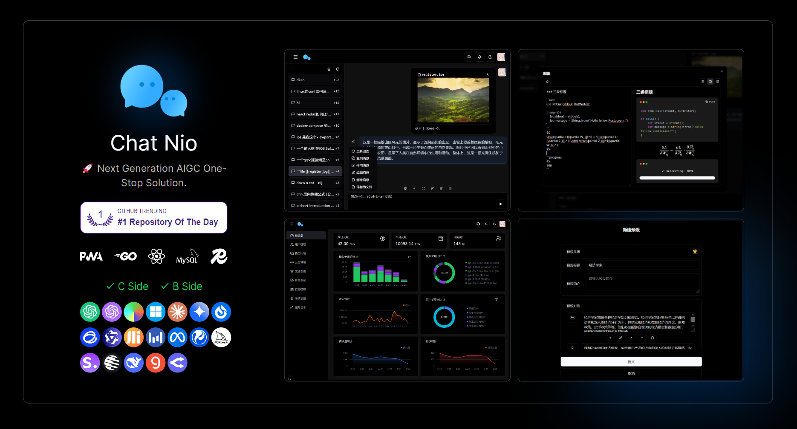
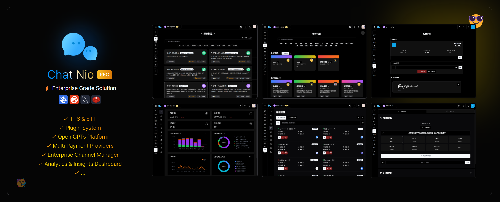

<div align="center">


# [🥳 Chat Nio](https://chatnio.com)

#### 🚀 次世代AIGCワンストップビジネスソリューション

#### *"Chat Nio > [Next Web](https://github.com/ChatGPTNextWeb/ChatGPT-Next-Web) + [One API](https://github.com/songquanpeng/one-api)"*


English · [简体中文](./README_zh-CN.md) · [日本語](./README_ja-JP.md) · [ドキュメント](https://chatnio.com) · [Discord](https://discord.gg/rpzNSmqaF2) · [デプロイガイド](https://chatnio.com/docs/deploy)

[](https://zeabur.com/templates/M86XJI)

[](https://trendshift.io/repositories/6369)



</div>

## 📝 機能
1. 🤖️ **豊富なモデルサポート**: 複数のモデルサービスプロバイダーのサポート (OpenAI / Anthropic / Gemini / Midjourney など十数種類の互換フォーマット & プライベートLLMサポート)
2. 🤯 **美しいUIデザイン**: PC / Pad / モバイルに対応したUI、[Shadcn UI](https://ui.shadcn.com) & [Tremor Charts](https://blocks.tremor.so) のデザイン基準に従った豊富で美しいインターフェースデザインとバックエンドダッシュボード
3. 🎃 **完全なMarkdownサポート**: **LaTeX数式** / **Mermaidマインドマップ** / テーブルレンダリング / コードハイライト / チャート描画 / プログレスバーなどの高度なMarkdown構文サポート
4. 👀 **マルチテーマサポート**: 複数のテーマ切り替えをサポート、ライトテーマの**ライトモード**とダークテーマの**ダークモード**を含む。 👉 [カスタムカラースキーム](https://github.com/Deeptrain-Community/chatnio/blob/main/app/src/assets/globals.less)
5. 📚 **国際化サポート**: 国際化をサポートし、複数の言語切り替えをサポート 🇨🇳 🇺🇸 🇯🇵 🇷🇺 👉 翻訳の貢献を歓迎します [Pull Request](https://github.com/Deeptrain-Community/chatnio/pulls)
6. 🎨 **テキストから画像へのサポート**: 複数のテキストから画像へのモデルをサポート: **OpenAI DALL-E**✅ & **Midjourney** ( **U/V/R** 操作をサポート)✅ & Stable Diffusion✅ など
7. 📡 **強力な会話同期**: **ユーザーのゼロコストクロスデバイス会話同期サポート**、**会話共有** (リンク共有 & 画像として保存 & 共有管理) をサポート、**WebDav / WebRTCなどの依存関係や複雑な学習コストは不要**
8. 🎈 **モデル市場 & プリセットシステム**: バックエンドでカスタマイズ可能なモデル市場をサポートし、モデルの紹介、タグなどのパラメータを提供。サイトオーナーは状況に応じてモデルの紹介をカスタマイズできます。また、**カスタムプリセット**と**クラウド同期**機能を含むプリセットシステムもサポート。
9. 📖 **豊富なファイル解析**: **すぐに使える**、**すべてのモデル**のファイル解析をサポート (PDF / Docx / Pptx / Excel / 画像形式の解析)、**より多くのクラウド画像ストレージソリューション** (S3 / R2 / MinIO など) をサポート、**OCR画像認識**をサポート 👉 詳細はプロジェクト [Chat Nio Blob Service](https://github.com/Deeptrain-Community/chatnio-blob-service) を参照 (Vercel / Dockerのワンクリックデプロイをサポート)
10. 🌏 **全モデルインターネット検索**: [SearXNG](https://github.com/searxng/searxng) オープンソースエンジンに基づき、Google / Bing / DuckDuckGo / Yahoo / Wikipedia / Arxiv / Qwant などの豊富な検索エンジン検索をサポート、安全検索モード、コンテンツ切り捨て、画像プロキシ、検索可用性テストなどの機能をサポート。
11. 💕 **プログレッシブウェブアプリ (PWA)**: PWAアプリケーションをサポートし、デスクトップサポート (デスクトップは [Tauri](https://github.com/tauri-apps/tauri) に基づく)
12. 🤩 **包括的なバックエンド管理**: 美しく豊富なダッシュボード、公告 & 通知管理、ユーザー管理、サブスクリプション管理、ギフトコード & 交換コード管理、価格設定、サブスクリプション設定、カスタムモデル市場、カスタムサイト名 & ロゴ、SMTPメール設定などの機能をサポート
13. 🤑 **複数の課金方法**: 💴 **サブスクリプション** と 💴 **エラスティック課金** の2つの課金方法をサポート。エラスティック課金は、リクエストごとの課金 / トークン課金 / 無課金 / 匿名通話をサポートし、**最小リクエストポイント** 検出などの強力な機能をサポート
14. 🎉 **革新的なモデルキャッシュ**: モデルキャッシュの有効化をサポート: 同じリクエストパラメータハッシュの下で、以前にリクエストされた場合、キャッシュ結果を直接返します (キャッシュヒットは課金されません)、リクエスト回数を減らします。キャッシュするモデル、キャッシュ時間、複数のキャッシュ結果数などの高度なキャッシュ設定をカスタマイズできます
15. 🥪 **追加機能** (サポート終了): 🍎 **AIプロジェクトジェネレーター機能** / 📂 **バッチ記事生成機能** / 🥪 **AIカード機能** (廃止)
16. 😎 **優れたチャネル管理**: 自作の優れたチャネルアルゴリズム、⚡ **マルチチャネル管理** をサポート、チャネル呼び出し順序の設定をサポート、同じ優先度のチャネルの負荷分散確率の設定をサポート、**ユーザーグループ化**、**失敗時の自動再試行**、**モデルリダイレクト**、**組み込みの上流非表示**、**チャネル状態管理** などの強力な**企業レベルの機能**をサポート
17. ⭐ **OpenAI API分散 & プロキシシステム**: **OpenAI API** 標準フォーマットでさまざまな大規模モデルを呼び出すことをサポートし、強力なチャネル管理機能を統合。1つのサイトをデプロイするだけで、B/Cエンドビジネスの同時開発を実現💖
18. 👌 **迅速な上流同期**: チャネル設定、モデル市場、価格設定などの設定を迅速に上流サイトと同期し、これに基づいてサイト設定を変更し、迅速にサイトを構築し、時間と労力を節約し、ワンクリック同期、迅速なオンライン化を実現
19. 👋 **SEO最適化**: SEO最適化をサポートし、カスタムサイト名、サイトロゴなどのSEO最適化設定をサポートし、検索エンジンがより速くクロールできるようにし、サイトを際立たせます👋
20. 🎫 **複数の交換コードシステム**: 複数の交換コードシステムをサポートし、ギフトコードと交換コードをサポートし、バッチ生成をサポート。ギフトコードはプロモーション配布に適しており、交換コードはカード販売に適しています。ギフトコードの1つのタイプの複数のコードは、1人のユーザーが1つのコードしか交換できないため、プロモーション中に1人のユーザーが複数回交換する状況をある程度減らします😀
21. 🥰 **ビジネスフレンドリーなライセンス**: **Apache-2.0** オープンソースライセンスを採用し、商用の二次開発 & 配布にフレンドリー (Apache-2.0ライセンスの規定を遵守し、違法な目的で使用しないでください)

> ### ✨ Chat Nio ビジネス版
>
> 
>
> - ✅ 美しい商用グレードのUI、エレガントなフロントエンドインターフェースとバックエンド管理
> - ✅ TTS & STT、プラグインマーケットプレイス、RAGナレッジベースなどの豊富な機能とモジュールをサポート
> - ✅ より多くの支払いプロバイダー、より多くの課金モデルと高度な注文管理をサポート
> - ✅ SMSログイン、OAuthログインなど、より多くの認証方法をサポート
> - ✅ モデル監視、チャネルの健康状態検出、障害アラーム自動チャネル切り替えをサポート
> - ✅ マルチテナントAPIキー配布システム、企業レベルのトークン権限管理と訪問者制限をサポート
> - ✅ セキュリティ監査、ログ記録、モデルレート制限、APIゲートウェイなどの高度な機能をサポート
> - ✅ プロモーション報酬、プロフェッショナルなデータ統計、ユーザープロファイル分析などのビジネス分析能力をサポート
> - ✅ Discord/Telegram/Feishuなどのボット統合機能をサポート (拡張モジュール)
> - ...
>
> [👉 詳細はこちら](https://www.chatnio.com/docs/contact)


## 🔨 サポートされているモデル
1. OpenAI & Azure OpenAI *(✅ Vision ✅ Function Calling)*
2. Anthropic Claude *(✅ Vision ✅ Function Calling)*
3. Google Gemini & PaLM2 *(✅ Vision)*
4. Midjourney *(✅ Mode Toggling ✅ U/V/R Actions)*
5. iFlytek SparkDesk *(✅ Vision ✅ Function Calling)*
6. Zhipu AI ChatGLM *(✅ Vision)*
7. Alibaba Tongyi Qwen
8. Tencent Hunyuan
9. Baichuan AI
10. Moonshot AI (👉 OpenAI)
11. DeepSeek AI (👉 OpenAI)
12. ByteDance Skylark *(✅ Function Calling)*
13. Groq Cloud AI
14. OpenRouter (👉 OpenAI)
15. 360 GPT
16. LocalAI / Ollama (👉 OpenAI)

## 👻 OpenAI互換APIプロキシ
   - [x] Chat Completions _(/v1/chat/completions)_
   - [x] Image Generation _(/v1/images)_
   - [x] Model List _(/v1/models)_
   - [x] Dashboard Billing _(/v1/billing)_


## 📦 デプロイ
> [!TIP]
> **デプロイが成功した後、管理者アカウントは `root` で、デフォルトのパスワードは `chatnio123456` です**

### ✨ Zeabur (ワンクリック)
[](https://zeabur.com/templates/M86XJI)

> Zeaburは一定の無料クォータを提供しており、非有料地域でのワンクリックデプロイをサポートし、プランサブスクリプションとエラスティック課金による柔軟な拡張もサポートしています。
> 1. `Deploy` をクリックしてデプロイし、バインドしたいドメイン名を入力し、デプロイが完了するのを待ちます。
> 2. デプロイが完了したら、ドメイン名にアクセスし、ユーザー名 `root` とパスワード `chatnio123456` を使用してバックエンド管理にログインします。チャットニオのバックエンドでパスワードを変更するように指示に従ってください。

### ⚡ Docker Composeインストール (推奨)
> [!NOTE]
> 実行が成功した後、ホストマシンのマッピングアドレスは `http://localhost:8000` です

```shell
git clone --depth=1 --branch=main --single-branch https://github.com/Deeptrain-Community/chatnio.git
cd chatnio
docker-compose up -d # サービスを実行
# 安定版を使用するには、docker-compose -f docker-compose.stable.yaml up -d を使用してください
# Watchtowerを使用して自動更新するには、docker-compose -f docker-compose.watch.yaml up -d を使用してください
```

バージョン更新 (_Watchtower自動更新が有効な場合、手動更新は不要です_):
```shell
docker-compose down 
docker-compose pull
docker-compose up -d
```

> - MySQLデータベースマウントディレクトリ: ~/**db**
> - Redisデータベースマウントディレクトリ: ~/**redis**
> - 設定ファイルマウントディレクトリ: ~/**config**

### ⚡ Dockerインストール (軽量ランタイム、外部 _MYSQL/RDS_ サービスでよく使用されます)
> [!NOTE]
> 実行が成功した後、ホストマシンのアドレスは `http://localhost:8094` です。
> 
> 安定版を使用するには、`programzmh/chatnio:stable` を `programzmh/chatnio:latest` の代わりに使用してください

```shell
docker run -d --name chatnio \
   --network host \
   -v ~/config:/config \
   -v ~/logs:/logs \
   -v ~/storage:/storage \
   -e MYSQL_HOST=localhost \
   -e MYSQL_PORT=3306 \
   -e MYSQL_DB=chatnio \
   -e MYSQL_USER=root \
   -e MYSQL_PASSWORD=chatnio123456 \
   -e REDIS_HOST=localhost \
   -e REDIS_PORT=6379 \
   -e SECRET=secret \
   -e SERVE_STATIC=true \
   programzmh/chatnio:latest
```

> - *--network host* はホストマシンのネットワークを使用することを意味し、Dockerコンテナがホストのネットワークを使用できるようにします。必要に応じて変更できます。
> - SECRET: JWTシークレットキー、ランダムな文字列を生成して適宜変更
> - SERVE_STATIC: 静的ファイルの提供を有効にするかどうか (通常、これを変更する必要はありません。詳細はFAQを参照)
> - *-v ~/config:/config* は設定ファイルをマウントし、*-v ~/logs:/logs* はログファイルのホストマシンディレクトリをマウントし、*-v ~/storage:/storage* は追加機能の生成ファイルのディレクトリをマウント
> - MySQLとRedisサービスを設定する必要があります。上記の情報を参照して環境変数を適宜変更してください

バージョン更新 (_Watchtowerを有効にした後、手動更新は不要です。実行後、上記の手順に従って再度実行してください_):

```shell
docker stop chatnio
docker rm chatnio
docker pull programzmh/chatnio:latest
```

### ⚒ コンパイルとインストール

> [!NOTE]
> デプロイが成功した後、デフォルトのポートは **8094** で、アクセスアドレスは `http://localhost:8094` です
> 
> 設定項目 (~/config/**config.yaml**) は環境変数を使用して上書きできます。例えば、`MYSQL_HOST` 環境変数は `mysql.host` 設定項目を上書きできます

```shell
git clone https://github.com/Deeptrain-Community/chatnio.git
cd chatnio

cd app
npm install -g pnpm
pnpm install
pnpm build

cd ..
go build -o chatnio

# 例: nohupを使用 (systemdや他のサービスマネージャーも使用できます)
nohup ./chatnio > output.log & # バックグラウンドで実行するためにnohupを使用
```

## 📦 技術スタック

- 🥗 フロントエンド: React + Redux + Radix UI + Tailwind CSS
- 🍎 バックエンド: Golang + Gin + Redis + MySQL
- 🍒 アプリケーション技術: PWA + WebSocket

## 🤯 なぜこのプロジェクトを作成したのか & プロジェクトの利点

- 市場にあるほとんどのAIGC商用サイトは、[Next Chat](https://github.com/ChatGPTNextWeb/ChatGPT-Next-Web) の商用版のように、美しいUIインターフェースデザインを持つフロントエンド指向の軽量デプロイプロジェクトです。個人のプライベート化指向の設計のため、二次商用開発にはいくつかの制限があり、いくつかの問題が発生します。例えば:
  1. **会話の同期が難しい**: 例えば、WebDavなどのサービスが必要で、ユーザーの学習コストが高く、クロスデバイスのリアルタイム同期が困難です。
  2. **課金が不十分**: 例えば、エラスティック課金のみをサポートするか、サブスクリプションのみをサポートし、異なるユーザーのニーズを満たすことができません。
  3. **ファイル解析が不便**: 例えば、最初に画像ホスティングサービスに画像をアップロードし、サイトに戻って入力ボックスにURL直リンクを入力する必要があり、組み込みのファイル解析機能がありません。
  4. **会話URL共有のサポートがない**: 例えば、会話のスクリーンショット共有のみをサポートし、会話URL共有をサポートしません (またはShareGPTなどのツールのみをサポートし、サイトのプロモーションには役立ちません)。
  5. **チャネル管理が不十分**: 例えば、バックエンドはOpenAIフォーマットのチャネルのみをサポートし、他のフォーマットのチャネルとの互換性が難しいです。そして、1つのチャネルしか入力できず、マルチチャネル管理をサポートしません。
  6. **API呼び出しのサポートがない**: 例えば、ユーザーインターフェース呼び出しのみをサポートし、APIプロキシと管理をサポートしません。

- もう1つのタイプは、[One API](https://github.com/songquanpeng/one-api) に基づくプロジェクトのように、強力な分散システムを持つAPI分散指向のサイトです。
これらのプロジェクトは強力なAPIプロキシと管理をサポートしていますが、インターフェースデザインといくつかのCエンド機能が不足しています。例えば:
  1. **ユーザーインターフェースが不十分**: 例えば、API呼び出しのみをサポートし、組み込みのユーザーインターフェースチャットがありません。ユーザーインターフェースチャットは、手動でキーをコピーして他のサイトに行って使用する必要があり、普通のユーザーにとって学習コストが高いです。
  2. **サブスクリプションシステムがない**: 例えば、エラスティック課金のみをサポートし、Cエンドユーザーの課金設計が不足しており、異なるユーザーのニーズを満たすことができず、基礎のないユーザーにとってコスト感知がフレンドリーではありません。
  3. **Cエンド機能が不十分**: 例えば、API呼び出しのみをサポートし、会話同期、会話共有、ファイル解析などの機能をサポートしません。
  4. **負荷分散が不十分**: オープンソース版は**重み**パラメータをサポートしておらず、同じ優先度のチャネルの負荷分散確率を実現できません ([New API](https://github.com/Calcium-Ion/new-api) もこの痛点を解決し、UIもより美しいです)。

したがって、これら2つのタイプのプロジェクトの利点を組み合わせて、強力なAPI分散システムと豊富なユーザーインターフェースデザインを持つプロジェクトを作成し、
Cエンドユーザーのニーズを満たしながらBエンドビジネスを開発し、ユーザーエクスペリエンスを向上させ、ユーザーの学習コストを削減し、ユーザーの粘着性を高めることを目指しています。

そのため、**Chat Nio** が誕生しました。強力なAPI分散システムと豊富なユーザーインターフェースデザインを持つプロジェクトを作成し、次世代のオープンソースAIGCプロジェクトのワンストップ商用ソリューションになることを目指しています。


## ❤ 寄付

このプロジェクトが役立つと思われる場合は、Starをクリックしてサポートを示すことができます！
